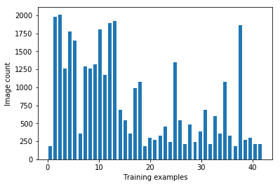
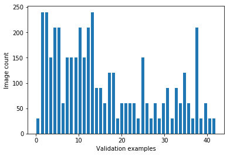
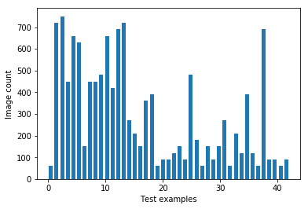
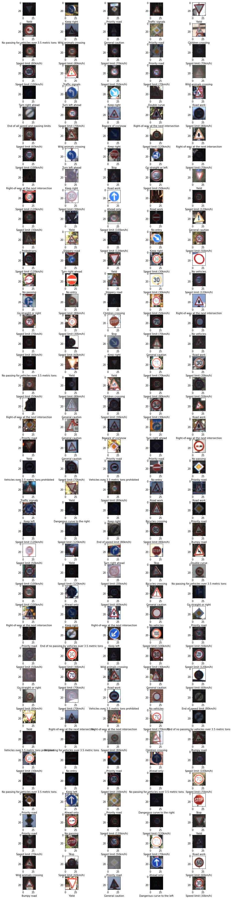
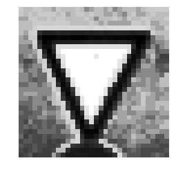

# **Traffic Sign Recognition** 

## Writeup
---

**Build a Traffic Sign Recognition Project**

The goals / steps of this project are the following:
* Load the data set (see below for links to the project data set)
* Explore, summarize and visualize the data set
* Design, train and test a model architecture
* Use the model to make predictions on new images
* Analyze the softmax probabilities of the new images
* Summarize the results with a written report


[//]: # (Image References)

[image1]: ./examples/visualization.jpg "Visualization"
[image2]: ./examples/grayscale.jpg "Grayscaling"
[image3]: ./examples/random_noise.jpg "Random Noise"
[image4]: ./examples/placeholder.png "Traffic Sign 1"
[image5]: ./examples/placeholder.png "Traffic Sign 2"
[image6]: ./examples/placeholder.png "Traffic Sign 3"
[image7]: ./examples/placeholder.png "Traffic Sign 4"
[image8]: ./examples/placeholder.png "Traffic Sign 5"

---
### Writeup / README

You're reading it! and here is a link to my [project code](https://view5f1639b6.udacity-student-workspaces.com/notebooks/CarND-Traffic-Sign-Classifier-Project/Traffic_Sign_Classifier.ipynb)

### Data Set Summary & Exploration

#### 1. Provide a basic summary of the data set. In the code, the analysis should be done using python, numpy and/or pandas methods rather than hardcoding results manually.

I used the python , numpy and pandas library to calculate summary statistics of the traffic

```python
### Replace each question mark with the appropriate value. 
### Use python, pandas or numpy methods rather than hard coding the results
import pandas as pd
import numpy as np

n_train = X_train.shape[0]
n_validation = X_valid.shape[0]
n_test = X_test.shape[0]
image_shape = X_train.shape[1:]
data = pd.read_csv('signnames.csv')
n_classes = data.shape[0]
signnames = list(data['SignName'])

print("Number of training examples =", n_train)
print("Number of testing examples =", n_test)
print("Image data shape =", image_shape)
print("Number of classes =", n_classes)
```

    Number of training examples = 34799
    Number of testing examples = 12630
    Image data shape = (32, 32, 3)
    Number of classes = 43


signs data set:

* The size of training set is 34799
* The size of the validation set is 4410
* The size of test set is 12630
* The shape of a traffic sign image is (32, 32, 3)
* The number of unique classes/labels in the data set is 43

#### 2. Include an exploratory visualization of the dataset.

Here is an exploratory visualization of the data set. It is a bar chart showing how the data ...

```python
def histogram_plot(dataset, label):
    hist, bins = np.histogram(dataset, bins=n_classes)
    width = 0.7 * (bins[1] - bins[0])
    center = (bins[:-1] + bins[1:]) / 2
    plt.bar(center, hist, align='center', width=width)
    plt.xlabel(label)
    plt.ylabel("Image count")
    plt.show()

histogram_plot(y_train, "Training examples")
histogram_plot(y_valid, "Validation examples")
histogram_plot(y_test, "Test examples")
```






```python
cols = 5
num_classes = n_classes

fig, axes = plt.subplots(nrows=n_classes, ncols=cols, figsize=(12, 50))
fig.tight_layout()
for i in range(n_classes*cols):
    plt.subplot(n_classes, cols, i+1)
    index = np.random.randint(0, len(X_train)-1)
    plt.imshow(X_train[index])
    plt.xlabel(signnames[y_train[index]])
    
```


### Design and Test a Model Architecture

#### 1. Describe how you preprocessed the image data. What techniques were chosen and why did you choose these techniques? Consider including images showing the output of each preprocessing technique. Pre-processing refers to techniques such as converting to grayscale, normalization, etc. (OPTIONAL: As described in the "Stand Out Suggestions" part of the rubric, if you generated additional data for training, describe why you decided to generate additional data, how you generated the data, and provide example images of the additional data. Then describe the characteristics of the augmented training set like number of images in the set, number of images for each class, etc.)

### Preprocessing pipeline

```python
def preprocessing(img):
    img = cv2.cvtColor(img, cv2.COLOR_BGR2GRAY)
    img = cv2.equalizeHist(img)
    img = img/255
    return img

Xtrain = np.array(list(map(preprocessing, X_train)))
Xvalid = np.array(list(map(preprocessing, X_valid)))
Xtest = np.array(list(map(preprocessing, X_test)))
```

#### 1. convert the images to grayscale 

Images are convered from RGB to grayscale for faster coversion of learning algorithm and less number of channels are required to processed.

#### 2. Histogram equalization

It increases the global contrast of images, especially when the usable data of the image is represented by close contrast values. The intensities are distributed better on the histogram after this process.
    
#### 3. Nomralization

It distributes all image values between 0.0 and 1.0. it is normalized between 0 and 1. 

Here is an example of a traffic sign image before and after grayscaling.

#### Before processing

#### After processing


#### 2. Describe what your final model architecture looks like including model type, layers, layer sizes, connectivity, etc.) Consider including a diagram and/or table describing the final model.

My final model consisted of the following layers:

| Layer         		|     Description	        					| 
|:---------------------:|:---------------------------------------------:| 
| Input         		| 32x32x3 RGB image   							| 
| Convolution 3x3     	| 1x1 stride, Valid padding, outputs 28x28x32 	|
| RELU					|												|
| Max pooling	      	| 2x2 stride,  outputs 14x14x32 				|
| Convolution 3x3	    | 1x1 stride, Valid padding, outputs 10x10x64   |
| RELU					|												|
| Max pooling    		| 2x2 stride,  outputs 5x5x64 				    |						
| Convolution 3x3	    | 1x1 stride, Valid padding, outputs 3x3x128    |
| RELU					|												|
| Max pooling    		| 2x2 stride,  outputs 3x3x128 				    |						
| Fully connected		| Input = 1152. Output = 500.        		    |
| RELU					|												|
| Fully connected		| Input = 500. Output = 84.        		        |
| RELU					|												|
| Fully connected		| Input = 84. Output = 43.        		        |
| Softmax				|         									    |
|
 
```python
### Define your architecture here.
### Feel free to use as many code cells as needed.

def LeNet(x):    
    # Arguments used for tf.truncated_normal, randomly defines variables for the weights and biases for each layer
    mu = 0
    sigma = 0.1
    
    # Layer 1: Convolutional. Input = 32x32x1. Output = 28x28x32.
    conv1_W = tf.Variable(tf.truncated_normal(shape=(5, 5, 1, 32), mean = mu, stddev = sigma))
    conv1_b = tf.Variable(tf.zeros(32))
    conv1   = tf.nn.conv2d(x, conv1_W, strides=[1, 1, 1, 1], padding='VALID') + conv1_b

    # Activation : Relu.
    conv1 = tf.nn.relu(conv1)

    # Pooling. Input = 28x28x32. Output = 14x14x32.
    conv1 = tf.nn.max_pool(conv1, ksize=[1, 2, 2, 1], strides=[1, 2, 2, 1], padding='VALID')

    # Layer 2: Convolutional. Input = 14x14x32 Output = 10x10x64.
    conv2_W = tf.Variable(tf.truncated_normal(shape=(5, 5, 32, 64), mean = mu, stddev = sigma))
    conv2_b = tf.Variable(tf.zeros(64))
    conv2   = tf.nn.conv2d(conv1, conv2_W, strides=[1, 1, 1, 1], padding='VALID') + conv2_b
    
    # Activation : Relu.
    conv2 = tf.nn.relu(conv2)

    # Pooling. Input = 10x10x64. Output = 5x5x64.
    conv2 = tf.nn.max_pool(conv2, ksize=[1, 2, 2, 1], strides=[1, 1, 1, 1], padding='VALID')
    
    # Layer 2: Convolutional. Input = 5x5x64 Output = 3x3x128.
    conv3_W = tf.Variable(tf.truncated_normal(shape=(3, 3, 64, 128), mean = mu, stddev = sigma))
    conv3_b = tf.Variable(tf.zeros(128))
    conv3   = tf.nn.conv2d(conv2, conv3_W, strides=[1, 1, 1, 1], padding='VALID') + conv3_b
    
    # Activation : Relu.
    conv3 = tf.nn.relu(conv3)

    # Pooling. Input = 3x3x128. Output = 3x3x128.
    conv3 = tf.nn.max_pool(conv3, ksize=[1, 2, 2, 1], strides=[1, 2, 2, 1], padding='VALID')
    
    # Flatten. Input = 3x3x128. Output = 1152.
    fc0   = flatten(conv3)
    
    # Layer 3: Fully Connected. Input = 1152. Output = 500.
    
    fc1_W = tf.Variable(tf.truncated_normal(shape=(1152, 500), mean = mu, stddev = sigma))
    fc1_b = tf.Variable(tf.zeros(500))
    fc1   = tf.matmul(fc0, fc1_W) + fc1_b
    
    # Activation.
    fc1    = tf.nn.relu(fc1)
    fc1    = tf.nn.dropout(fc1, 0.75)
    
    # Layer 4: Fully Connected. Input = 500. Output = 84.
    fc2_W  = tf.Variable(tf.truncated_normal(shape=(500, 84), mean = mu, stddev = sigma))
    fc2_b  = tf.Variable(tf.zeros(84))
    fc2    = tf.matmul(fc1, fc2_W) + fc2_b
    
    # Activation.
    fc2    = tf.nn.relu(fc2)
    fc2    = tf.nn.dropout(fc2, 0.75)
    
    # Layer 5: Fully Connected. Input = 84. Output = n_classes(43).
    fc3_W  = tf.Variable(tf.truncated_normal(shape=(84, n_classes), mean = mu, stddev = sigma))
    fc3_b  = tf.Variable(tf.zeros(n_classes))
    logits = tf.matmul(fc2, fc3_W) + fc3_b
    
    return logits
```


#### 3. Describe how you trained your model. The discussion can include the type of optimizer, the batch size, number of epochs and any hyperparameters such as learning rate.

To train the model, 

#### Hyper parameters used in model
learning rate = 0.0001
EPOCHS = 100
BATCH_SIZE = 256
Optimizer - Adam optimizer

### Filters 
convolution layer - 1
    filter size = (5,5) , Number of filters - 32, Stride = 2, Valid padding
Pooling layer - 1  
    filter size = (2,2) , Stride = 2, Valid padding
convolution layer - 2
    filter size = (5,5) , Number of filters - 64, Stride = 2, Valid padding
Pooling layer - 2  
    filter size = (2,2) , Stride = 2, Valid padding
convolution layer - 3
    filter size = (3,3) , Number of filters - 128, Stride = 1, Valid padding
Pooling layer - 3  
    filter size = (2,2) , Stride = 2, Valid padding

```python
rate = 0.0001
EPOCHS = 100
BATCH_SIZE = 256

logits = LeNet(x)
cross_entropy = tf.nn.softmax_cross_entropy_with_logits(labels=one_hot_y, logits=logits)
loss_operation = tf.reduce_mean(cross_entropy)
optimizer = tf.train.AdamOptimizer(learning_rate = rate)
training_operation = optimizer.minimize(loss_operation)
```


#### 4. Describe the approach taken for finding a solution and getting the validation set accuracy to be at least 0.93. Include in the discussion the results on the training, validation and test sets and where in the code these were calculated. Your approach may have been an iterative process, in which case, outline the steps you took to get to the final solution and why you chose those steps. Perhaps your solution involved an already well known implementation or architecture. In this case, discuss why you think the architecture is suitable for the current problem.

My final model results were:
* training set accuracy of 0.998
* validation set accuracy of 0.959
* test set accuracy of 0.933

Used iterative approach:

#### Reducing learning rate
Learning rate is configured at 0.001, model is not giving better result at this learning rate, Training accuracy is low when learning rate is 0.001 in 100 epochs. Reduced learning rate from 0.001 to 0.0001

#### Choosing Adam optmizer over Mini batch gradient decent

Adam optimizer is selected over mini batch Gradient discent, Adam optimizer combines advantage of AdaGrad and RMSProp optmizers and coverges faster.   

#### Tweaking batch size
Batch size is reduced from 1024 to 256. 

#### Number of filters and adding convolution later -3 
Number of filters are increased from LeNet model, The primary reason for increasing number of filers and adding convolution later -3 is to increase train accuracy and adjustment for dataset. Lenet model is perfect to recognize the digits. By visiualizing dataset images, it seems that more features are required to be extracted for traffic signs. First layer has 32 filters to detect edges, lines and shapes, second layer has 64 filters and 3rd conv layer has 128 filters.

#### Dropout
After above tweaking , Training accuracy is achived around 99% but validation accuracy is still at 89-91%. Added dropout to reduce overfitting, first tried with 50% dropout and tweaked to 75% to achieve validation accuracy ~96%

```python
correct_prediction = tf.equal(tf.argmax(logits, 1), tf.argmax(one_hot_y, 1))
accuracy_operation = tf.reduce_mean(tf.cast(correct_prediction, tf.float32))
saver = tf.train.Saver()
```

```python
def evaluate(Xtrain, y_train):
    num_examples = len(Xtrain)
    total_accuracy = 0
    sess = tf.get_default_session()
    for offset in range(0, num_examples, BATCH_SIZE):
        batch_x, batch_y = Xtrain[offset:offset+BATCH_SIZE], y_train[offset:offset+BATCH_SIZE]
        accuracy = sess.run(accuracy_operation, feed_dict={x: batch_x, y: batch_y})
        total_accuracy += (accuracy * len(batch_x))
    return total_accuracy / num_examples
```


```python
with tf.Session() as sess:
    sess.run(tf.global_variables_initializer())
    num_examples = len(Xtrain)
    print("Training...")
    print()
    for i in range(EPOCHS):
        Xtrain, y_train = shuffle(Xtrain, y_train)
        for offset in range(0, num_examples, BATCH_SIZE):
            end = offset + BATCH_SIZE
            batch_x, batch_y = Xtrain[offset:end], y_train[offset:end]
            sess.run(training_operation, feed_dict={x: batch_x, y: batch_y})
        
        train_accuracy = evaluate(Xtrain, y_train)
        validation_accuracy = evaluate(Xvalid, y_valid)
        print("EPOCH {} ...".format(i+1))
        print("Train Accuracy = {:.3f}".format(train_accuracy))
        print("Validation Accuracy = {:.3f}".format(validation_accuracy))
        print()
        
    saver.save(sess, './lenet')
    print("Model saved")
```

 Training...
    
    EPOCH 1 ...
    Train Accuracy = 0.339
    Validation Accuracy = 0.299
    
    EPOCH 2 ...
    Train Accuracy = 0.539
    Validation Accuracy = 0.489
    
    EPOCH 3 ...
    Train Accuracy = 0.657
    Validation Accuracy = 0.627
    
    EPOCH 4 ...
    Train Accuracy = 0.729
    Validation Accuracy = 0.696
    
    EPOCH 5 ...
    Train Accuracy = 0.781
    Validation Accuracy = 0.739
    
    EPOCH 6 ...
    Train Accuracy = 0.815
    Validation Accuracy = 0.773
    
    EPOCH 7 ...
    Train Accuracy = 0.840
    Validation Accuracy = 0.795
    
    EPOCH 8 ...
    Train Accuracy = 0.859
    Validation Accuracy = 0.821
    
    EPOCH 9 ...
    Train Accuracy = 0.878
    Validation Accuracy = 0.834
    
    EPOCH 10 ...
    Train Accuracy = 0.890
    Validation Accuracy = 0.843
    
    EPOCH 11 ...
    Train Accuracy = 0.904
    Validation Accuracy = 0.856
    
    EPOCH 12 ...
    Train Accuracy = 0.910
    Validation Accuracy = 0.865
    
    EPOCH 13 ...
    Train Accuracy = 0.918
    Validation Accuracy = 0.873
    
    EPOCH 14 ...
    Train Accuracy = 0.925
    Validation Accuracy = 0.878
    
    EPOCH 15 ...
    Train Accuracy = 0.932
    Validation Accuracy = 0.887
    
    EPOCH 16 ...
    Train Accuracy = 0.936
    Validation Accuracy = 0.887
    
    EPOCH 17 ...
    Train Accuracy = 0.945
    Validation Accuracy = 0.897
    
    EPOCH 18 ...
    Train Accuracy = 0.949
    Validation Accuracy = 0.900
    
    EPOCH 19 ...
    Train Accuracy = 0.951
    Validation Accuracy = 0.902
    
    EPOCH 20 ...
    Train Accuracy = 0.957
    Validation Accuracy = 0.905
    
    EPOCH 21 ...
    Train Accuracy = 0.955
    Validation Accuracy = 0.905
    
    EPOCH 22 ...
    Train Accuracy = 0.963
    Validation Accuracy = 0.910
    
    EPOCH 23 ...
    Train Accuracy = 0.960
    Validation Accuracy = 0.908
    
    EPOCH 24 ...
    Train Accuracy = 0.964
    Validation Accuracy = 0.909
    
    EPOCH 25 ...
    Train Accuracy = 0.969
    Validation Accuracy = 0.921
    
    EPOCH 26 ...
    Train Accuracy = 0.968
    Validation Accuracy = 0.916
    
    EPOCH 27 ...
    Train Accuracy = 0.969
    Validation Accuracy = 0.913
    
    EPOCH 28 ...
    Train Accuracy = 0.975
    Validation Accuracy = 0.926
    
    EPOCH 29 ...
    Train Accuracy = 0.975
    Validation Accuracy = 0.925
    
    EPOCH 30 ...
    Train Accuracy = 0.977
    Validation Accuracy = 0.921
    
    EPOCH 31 ...
    Train Accuracy = 0.978
    Validation Accuracy = 0.925
    
    EPOCH 32 ...
    Train Accuracy = 0.979
    Validation Accuracy = 0.927
    
    EPOCH 33 ...
    Train Accuracy = 0.981
    Validation Accuracy = 0.927
    
    EPOCH 34 ...
    Train Accuracy = 0.983
    Validation Accuracy = 0.936
    
    EPOCH 35 ...
    Train Accuracy = 0.983
    Validation Accuracy = 0.933
    
    EPOCH 36 ...
    Train Accuracy = 0.984
    Validation Accuracy = 0.932
    
    EPOCH 37 ...
    Train Accuracy = 0.983
    Validation Accuracy = 0.933
    
    EPOCH 38 ...
    Train Accuracy = 0.983
    Validation Accuracy = 0.936
    
    EPOCH 39 ...
    Train Accuracy = 0.985
    Validation Accuracy = 0.932
    
    EPOCH 40 ...
    Train Accuracy = 0.986
    Validation Accuracy = 0.940
    
    EPOCH 41 ...
    Train Accuracy = 0.984
    Validation Accuracy = 0.933
    
    EPOCH 42 ...
    Train Accuracy = 0.988
    Validation Accuracy = 0.937
    
    EPOCH 43 ...
    Train Accuracy = 0.988
    Validation Accuracy = 0.940
    
    EPOCH 44 ...
    Train Accuracy = 0.987
    Validation Accuracy = 0.934
    
    EPOCH 45 ...
    Train Accuracy = 0.989
    Validation Accuracy = 0.939
    
    EPOCH 46 ...
    Train Accuracy = 0.990
    Validation Accuracy = 0.939
    
    EPOCH 47 ...
    Train Accuracy = 0.990
    Validation Accuracy = 0.936
    
    EPOCH 48 ...
    Train Accuracy = 0.991
    Validation Accuracy = 0.941
    
    EPOCH 49 ...
    Train Accuracy = 0.991
    Validation Accuracy = 0.943
    
    EPOCH 50 ...
    Train Accuracy = 0.991
    Validation Accuracy = 0.939
    
    EPOCH 51 ...
    Train Accuracy = 0.992
    Validation Accuracy = 0.938
    
    EPOCH 52 ...
    Train Accuracy = 0.993
    Validation Accuracy = 0.946
    
    EPOCH 53 ...
    Train Accuracy = 0.991
    Validation Accuracy = 0.940
    
    EPOCH 54 ...
    Train Accuracy = 0.994
    Validation Accuracy = 0.948
    
    EPOCH 55 ...
    Train Accuracy = 0.992
    Validation Accuracy = 0.943
    
    EPOCH 56 ...
    Train Accuracy = 0.995
    Validation Accuracy = 0.951
    
    EPOCH 57 ...
    Train Accuracy = 0.994
    Validation Accuracy = 0.951
    
    EPOCH 58 ...
    Train Accuracy = 0.995
    Validation Accuracy = 0.947
    
    EPOCH 59 ...
    Train Accuracy = 0.994
    Validation Accuracy = 0.949
    
    EPOCH 60 ...
    Train Accuracy = 0.994
    Validation Accuracy = 0.947
    
    EPOCH 61 ...
    Train Accuracy = 0.994
    Validation Accuracy = 0.948
    
    EPOCH 62 ...
    Train Accuracy = 0.996
    Validation Accuracy = 0.950
    
    EPOCH 63 ...
    Train Accuracy = 0.995
    Validation Accuracy = 0.944
    
    EPOCH 64 ...
    Train Accuracy = 0.995
    Validation Accuracy = 0.946
    
    EPOCH 65 ...
    Train Accuracy = 0.995
    Validation Accuracy = 0.946
    
    EPOCH 66 ...
    Train Accuracy = 0.994
    Validation Accuracy = 0.950
    
    EPOCH 67 ...
    Train Accuracy = 0.995
    Validation Accuracy = 0.949
    
    EPOCH 68 ...
    Train Accuracy = 0.996
    Validation Accuracy = 0.954
    
    EPOCH 69 ...
    Train Accuracy = 0.996
    Validation Accuracy = 0.953
    
    EPOCH 70 ...
    Train Accuracy = 0.997
    Validation Accuracy = 0.955
    
    EPOCH 71 ...
    Train Accuracy = 0.997
    Validation Accuracy = 0.954
    
    EPOCH 72 ...
    Train Accuracy = 0.996
    Validation Accuracy = 0.951
    
    EPOCH 73 ...
    Train Accuracy = 0.997
    Validation Accuracy = 0.954
    
    EPOCH 74 ...
    Train Accuracy = 0.995
    Validation Accuracy = 0.951
    
    EPOCH 75 ...
    Train Accuracy = 0.997
    Validation Accuracy = 0.951
    
    EPOCH 76 ...
    Train Accuracy = 0.998
    Validation Accuracy = 0.949
    
    EPOCH 77 ...
    Train Accuracy = 0.997
    Validation Accuracy = 0.952
    
    EPOCH 78 ...
    Train Accuracy = 0.998
    Validation Accuracy = 0.954
    
    EPOCH 79 ...
    Train Accuracy = 0.998
    Validation Accuracy = 0.949
    
    EPOCH 80 ...
    Train Accuracy = 0.998
    Validation Accuracy = 0.957
    
    EPOCH 81 ...
    Train Accuracy = 0.998
    Validation Accuracy = 0.953
    
    EPOCH 82 ...
    Train Accuracy = 0.998
    Validation Accuracy = 0.953
    
    EPOCH 83 ...
    Train Accuracy = 0.997
    Validation Accuracy = 0.949
    
    EPOCH 84 ...
    Train Accuracy = 0.997
    Validation Accuracy = 0.955
    
    EPOCH 85 ...
    Train Accuracy = 0.996
    Validation Accuracy = 0.951
    
    EPOCH 86 ...
    Train Accuracy = 0.997
    Validation Accuracy = 0.951
    
    EPOCH 87 ...
    Train Accuracy = 0.998
    Validation Accuracy = 0.948
    
    EPOCH 88 ...
    Train Accuracy = 0.998
    Validation Accuracy = 0.953
    
    EPOCH 89 ...
    Train Accuracy = 0.998
    Validation Accuracy = 0.954
    
    EPOCH 90 ...
    Train Accuracy = 0.998
    Validation Accuracy = 0.954
    
    EPOCH 91 ...
    Train Accuracy = 0.996
    Validation Accuracy = 0.949
    
    EPOCH 92 ...
    Train Accuracy = 0.998
    Validation Accuracy = 0.950
    
    EPOCH 93 ...
    Train Accuracy = 0.998
    Validation Accuracy = 0.949
    
    EPOCH 94 ...
    Train Accuracy = 0.998
    Validation Accuracy = 0.958
    
    EPOCH 95 ...
    Train Accuracy = 0.999
    Validation Accuracy = 0.960
    
    EPOCH 96 ...
    Train Accuracy = 0.999
    Validation Accuracy = 0.954
    
    EPOCH 97 ...
    Train Accuracy = 0.998
    Validation Accuracy = 0.958
    
    EPOCH 98 ...
    Train Accuracy = 0.998
    Validation Accuracy = 0.954
    
    EPOCH 99 ...
    Train Accuracy = 0.999
    Validation Accuracy = 0.959
    
    EPOCH 100 ...
    Train Accuracy = 0.998
    Validation Accuracy = 0.959
    

### Test a Model on New Images

#### 1. Choose five German traffic signs found on the web and provide them in the report. For each image, discuss what quality or qualities might be difficult to classify.

Here are five German traffic signs that I found on the web:

![alt text][image4] ![alt text][image5] ![alt text][image6] 
![alt text][image7] ![alt text][image8]

The first image might be difficult to classify because ...

#### 2. Discuss the model's predictions on these new traffic signs and compare the results to predicting on the test set. At a minimum, discuss what the predictions were, the accuracy on these new predictions, and compare the accuracy to the accuracy on the test set (OPTIONAL: Discuss the results in more detail as described in the "Stand Out Suggestions" part of the rubric).

Here are the results of the prediction:

| Image			        |     Prediction	        					| 
|:---------------------:|:---------------------------------------------:| 
| Stop Sign      		| Stop sign   									| 
| U-turn     			| U-turn 										|
| Yield					| Yield											|
| 100 km/h	      		| Bumpy Road					 				|
| Slippery Road			| Slippery Road      							|


The model was able to correctly guess 4 of the 5 traffic signs, which gives an accuracy of 80%. This compares favorably to the accuracy on the test set of ...

#### 3. Describe how certain the model is when predicting on each of the five new images by looking at the softmax probabilities for each prediction. Provide the top 5 softmax probabilities for each image along with the sign type of each probability. (OPTIONAL: as described in the "Stand Out Suggestions" part of the rubric, visualizations can also be provided such as bar charts)

The code for making predictions on my final model is located in the 11th cell of the Ipython notebook.

For the first image, the model is relatively sure that this is a stop sign (probability of 0.6), and the image does contain a stop sign. The top five soft max probabilities were

| Probability         	|     Prediction	        					| 
|:---------------------:|:---------------------------------------------:| 
| .60         			| Stop sign   									| 
| .20     				| U-turn 										|
| .05					| Yield											|
| .04	      			| Bumpy Road					 				|
| .01				    | Slippery Road      							|


For the second image ... 

### (Optional) Visualizing the Neural Network (See Step 4 of the Ipython notebook for more details)
#### 1. Discuss the visual output of your trained network's feature maps. What characteristics did the neural network use to make classifications?


